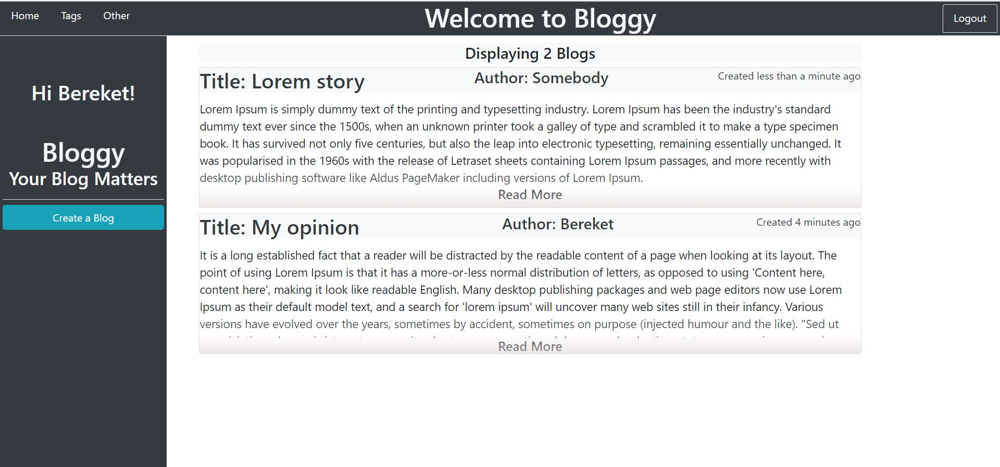

# Twitter Clone
[![Contributors][contributors-shield]][contributors-url]
[![Forks][forks-shield]][forks-url]
[![Stargazers][stars-shield]][stars-url]
[![Issues][issues-shield]][issues-url]
[![License: MIT][license-shield]][license-url]
[![LinkedIn][linkedin-shield]][linkedin-url]

## See the Live version here - > [Live Link](https://floating-spire-38271.herokuapp.com)

## Built With

- Ruby on Rails
- Bootstrap
- postgresql
- VScode
- Rubocop
- Heroku

## Author

👤 **Bereket Beshane**

- Github: [@berabjesus](https://github.com/Berabjesus)
- Twitter: [@bereket_ababu_b](https://twitter.com/bereket_ababu_b)
- Linkedin: [linkedin](https://www.linkedin.com/in/bereket-beshane-a1b75a1a9/)

## 🤝 Contributing

Contributions, issues and feature requests are welcome!

## Show your support

Give a ⭐️ if you like this project!

## Acknowledgments

- Microverse
- Heroku
## 📝 License

This project is [MIT](LICENSE) licensed.

[contributors-shield]: https://img.shields.io/github/contributors/Berabjesus/Twitter-Clone
[contributors-url]: https://github.com/Berabjesus/Bloggy/contributors
[forks-shield]: https://img.shields.io/github/forks/Berabjesus/Twitter-Clone
[forks-url]: https://github.com/Berabjesus/Bloggy/network/members
[stars-shield]: https://img.shields.io/github/stars/Berabjesus/Twitter-Clone
[stars-url]: https://github.com/Berabjesus/Bloggy/stargazers
[issues-shield]: https://img.shields.io/github/issues/Berabjesus/Twitter-Clone
[issues-url]: https://github.com/Berabjesus/Bloggy/issues
[license-shield]: https://img.shields.io/badge/License-MIT-yellow.svg
[license-url]: https://github.com/Berabjesus/Bloggy/LICENSE
[linkedin-shield]: https://img.shields.io/badge/-LinkedIn-black.svg?style=flat-square&logo=linkedin&colorB=555
[linkedin-url]: https://www.linkedin.com/in/bereket-beshane-a1b75a1a9/
